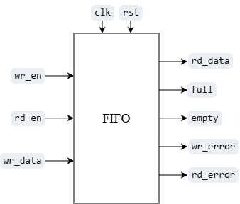

# FIFO UVM Verification Project

这是一个同步 FIFO 设计与 UVM 验证学习项目。项目按照 spec、RTL、基础 testbench、UVM 验证平台、覆盖率与回归的顺序逐步完成。

目前已完成 FIFO RTL、spec、vplan、基础 testbench，以及 UVM 的激励、采样、reference model 和自动比较。下一步按照 vplan 编写测试激励。

基础 testbench 用于观察读写信号和波形；当前 UVM test 已能自动比较 DUT 与 reference model 的结果，尚未覆盖完整的读写场景。

- [spec](doc/fifo_spec.md)：参数、接口、复位、读写操作和错误信号。
- [vplan](doc/verification_plan.md)：测试步骤、检查方法、覆盖率和回归通过条件。

## DUT 设计说明

DUT 模块名为 `fifo`，默认参数为：

```text
width = 8
depth = 16
```

主要特点：

- 单时钟同步读写；
- 高电平有效的异步复位；
- 使用带回卷位的扩展读写指针判断空满；
- FIFO 可以使用完整的 `depth` 个存储位置；
- `width` 必须不小于 1，`depth` 必须不小于 2，并且是 2 的幂；
- 读数据在成功读取的上升沿后更新，不会在写入后自动显示；
- 满写和空读会被拒绝；
- 非法操作分别通过 `wr_error` 和 `rd_error` 输出；
- RAM 不复位，复位时清除指针、读数据和错误输出。

## DUT 接口

<p align="center">
  
</p>

| 信号 | 方向 | 位宽 | 说明 |
|---|---|---:|---|
| `clk` | input | 1 | FIFO 工作时钟 |
| `rst` | input | 1 | 高电平有效的异步复位 |
| `wr_en` | input | 1 | 写使能 |
| `wr_data` | input | `width` | 写入数据 |
| `rd_en` | input | 1 | 读使能 |
| `rd_data` | output | `width` | 最近一次成功读取的数据，复位时清零 |
| `full` | output | 1 | FIFO 满标志 |
| `empty` | output | 1 | FIFO 空标志 |
| `wr_error` | output | 1 | 满状态下发生写请求 |
| `rd_error` | output | 1 | 空状态下发生读请求 |

合法读写条件为：

```systemverilog
wr_valid = wr_en && !full;
rd_valid = rd_en && !empty;
```

读写请求根据时钟上升沿之前的空满状态独立判断：

| FIFO 当前状态 | `wr_en` | `rd_en` | 写操作 | 读操作 |
|---|---:|---:|---|---|
| 非空非满 | 1 | 1 | 成功 | 成功 |
| 空 | 1 | 1 | 成功 | 拒绝 |
| 满 | 1 | 1 | 拒绝 | 成功 |

除复位外，`rd_data` 只在成功读取的上升沿后更新。没有读请求或空读时，`rd_data` 保持原值。

错误信号在每个上升沿重新计算：本次满写则 `wr_error=1`，本次空读则 `rd_error=1`；下一拍没有对应错误时清零。

## 目录结构

```text
FIFO_UVM/
├── doc/
│   ├── fifo_spec.md              # FIFO 设计说明
│   └── verification_plan.md      # FIFO 验证计划
├── doc/images/
│   └── fifo_interface_diagram.png # FIFO 信号图
├── rtl/
│   └── fifo.v                    # FIFO RTL
├── smoke/
│   └── fifo_tb.sv                # 非 UVM smoke testbench
├── tb/
│   ├── fifo_if.sv                # 接口信号、driver 和 monitor 的 clocking block
│   ├── fifo_tb_top.sv            # 时钟、复位、DUT 连接和 UVM 启动
│   ├── agents/                   # item、sequencer、driver、monitor 和 agent
│   ├── env/                      # env、reference model 和 scoreboard
│   ├── seq/                      # FIFO sequence
│   ├── sva/                      # assertions（待实现）
│   └── tests/
│       └── fifo_test.sv          # 创建 env 并启动 sequence
└── sim/
    ├── Makefile                  # 编译和仿真入口（待完成）
    ├── filelist.f                # UVM 文件列表（待完成）
    └── regress.py                # 回归脚本（待完成）
```

## 当前进度

- [x] spec 和 vplan
- [x] RTL 和 smoke 测试
- [x] UVM top 和 interface
- [x] item、sequence、sequencer 和 driver
- [x] monitor 和 agent
- [x] env、reference model 和 scoreboard
- [ ] vplan 定向测试用例
- [ ] 约束随机和参数测试
- [ ] 功能覆盖率和 SVA
- [ ] 自动回归和覆盖率收敛
- [ ] 错误注入和验证收尾

## 运行 UVM 测试

安装并配置好 VCS 后，在项目根目录执行：

```bash
vcs -full64 -sverilog -ntb_opts uvm \
    -timescale=1ns/1ps \
    +incdir+tb \
    -kdb -debug_access+all \
    rtl/fifo.v \
    tb/fifo_if.sv \
    tb/fifo_tb_top.sv \
    -top fifo_tb_top \
    -o simv_if

./simv_if
```

当前 UVM test 能运行基本激励，并由 scoreboard 比较 DUT 与 reference model 的结果。smoke 测试和 Verdi 波形用于辅助观察，具体命令不在 README 中展开。

## 环境

| 工具 | 版本 |
| --- | --- |
| VCS | V-2023.12-SP2 |
| Verdi | V-2023.12-SP2 |
| SCL | 2021.03 |
| OS | Ubuntu 22.04.5 LTS，VMware 虚拟机 |
| X Server | VcXsrv（Windows） |

> 最后更新：2026-09-18
